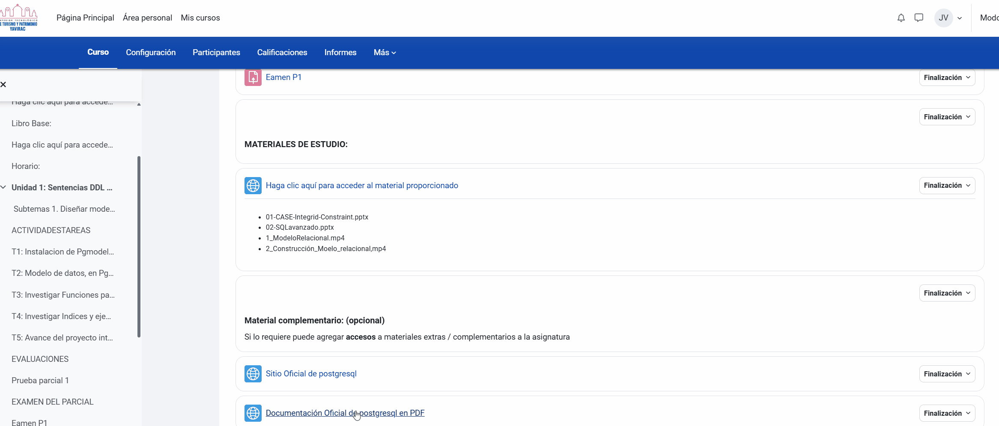
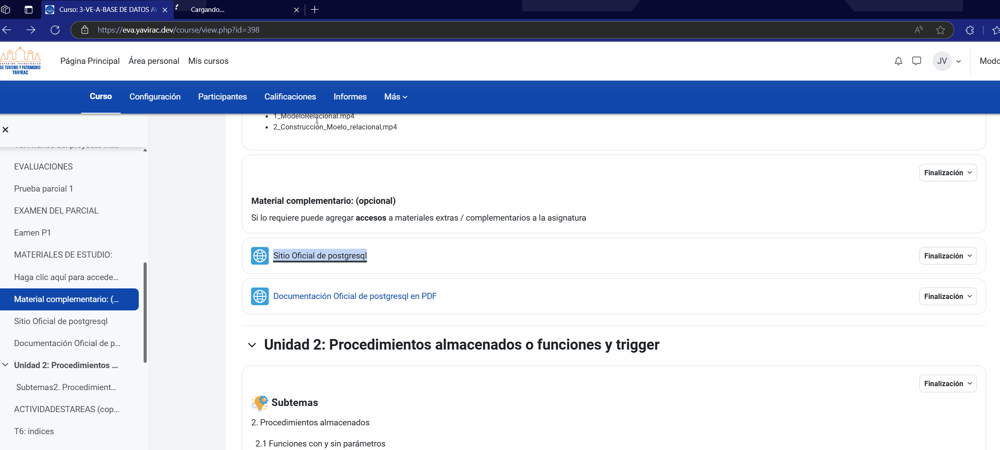

## 3. 📥 Acceso y Descarga de Materiales

### Guía para Acceso y Descarga de Materiales en EVA Yavirac

Dentro de EVA Yavirac, tus docentes pueden subir recursos educativos, como documentos, videos y enlaces externos. Aquí te mostramos cómo visualizar y descargar estos materiales.

## Paso 1: Ver y Descargar Recursos

1. Una vez dentro de tu curso, dirígete a la sección correspondiente de **Materiales** o **Recursos** (el nombre puede variar según el curso).
2. En esta sección, verás una lista de archivos que pueden incluir documentos PDF, archivos de Word, presentaciones de PowerPoint, entre otros.

   

3. Para **ver** un archivo directamente en el navegador, haz clic sobre el nombre del archivo. Dependiendo del tipo de archivo y de la configuración del navegador, el archivo se abrirá en una nueva pestaña o directamente en la ventana actual.
4. Para **descargar** el archivo a tu dispositivo, haz clic derecho en el nombre del archivo y selecciona la opción **Guardar enlace como...** o **Descargar**.

   

> **Tip:** Algunos archivos pueden descargarse automáticamente al hacer clic en ellos. Verifica en la carpeta de **Descargas** de tu dispositivo.

## Paso 2: Acceso a Recursos Multimedia

1. En la misma sección de recursos, es común que encuentres enlaces a **videos, audios** o **enlaces externos** que los docentes hayan compartido.
2. Para acceder a un video o enlace multimedia:
   - Haz clic sobre el enlace del video o del recurso multimedia.
   - Si el enlace dirige a una plataforma de video (como YouTube), serás redirigido automáticamente a esa página o el video se abrirá en el mismo navegador.

   

4. Si deseas **guardar el enlace** para verlo más tarde, puedes hacer clic derecho en el enlace y seleccionar **Copiar enlace**. Luego, puedes guardarlo en tus notas o en cualquier archivo de texto.

> **Nota:** Algunos videos y enlaces externos pueden requerir permisos adicionales o inicio de sesión en otras plataformas, según el acceso establecido por el docente.

## Paso 3: Descargar Recursos Adicionales

1. Algunos materiales pueden venir en formatos especiales (por ejemplo, archivos ZIP). Para descargarlos, sigue el mismo procedimiento de descarga y luego descomprime el archivo en tu dispositivo para acceder al contenido.
2. Si tienes problemas para abrir algún tipo de archivo, verifica que tengas el software adecuado instalado (por ejemplo, Adobe Reader para PDF, Word para documentos .docx, etc.).

---

¡Con estos pasos podrás acceder a todos los materiales que tus docentes compartan en EVA Yavirac! Si tienes problemas para abrir o descargar un archivo, no dudes en contactar a soporte técnico.

---

**Instituto Yavirac**  
EVA - Entorno Virtual de Aprendizaje
