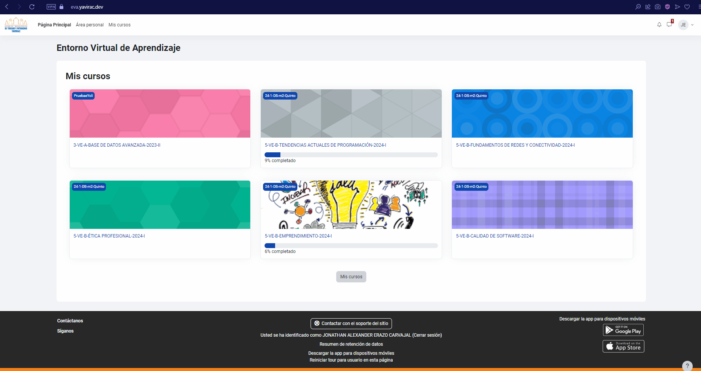

### Interfaz principal

La **interfaz principal** de Moodle es el punto de partida para acceder a todas las herramientas y recursos necesarios en tu proceso de aprendizaje. Al ingresar, verás el **tablero de control**, que te permitirá gestionar y visualizar toda la información relevante sobre tus cursos. En esta sección, exploraremos los siguientes elementos clave:

- **Cursos**: Visualiza todos los cursos en los que estás inscrito, accede a ellos con un solo clic y explora los módulos, actividades y materiales disponibles.
    

- **Actividades**: Desde el area personal, podrás ver las actividades pendientes y programadas, lo que te permitirá estar al tanto de las tareas y evaluaciones.
    
- **Notificaciones**: Recibe alertas sobre anuncios importantes, cambios en los cursos, calificaciones y otros eventos clave relacionados con tu progreso académico.
    

Conocer y dominar la interfaz principal te ayudará a moverte con facilidad dentro de la plataforma y mantenerte organizado durante todo el proceso educativo.
 