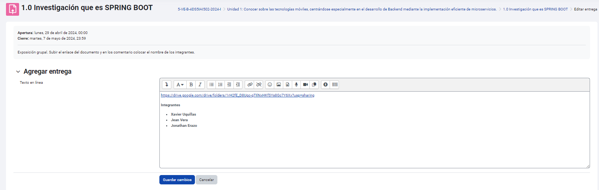
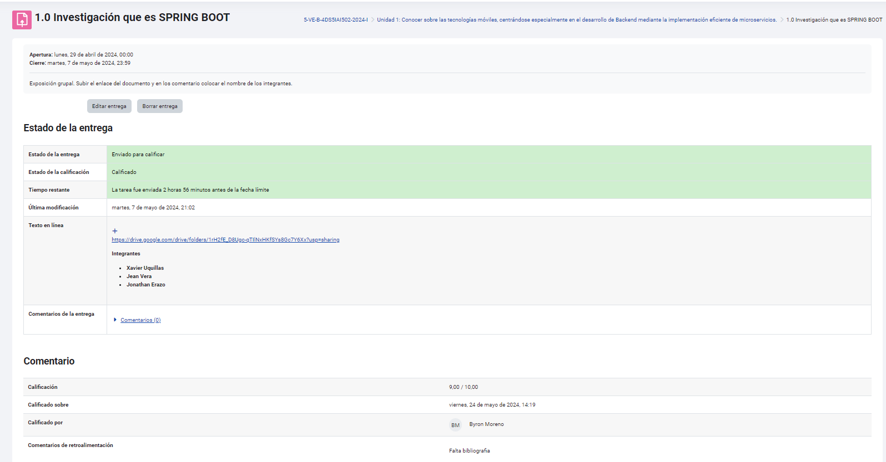

# Tareas
 
   Las tareas se identifican con un ícono rosado y un símbolo de archivo. En cada tarea, podrás:
   - Ver el **estado de entrega**, **estado de calificación**, **tiempo restante**, última **modificación** y **comentarios**.
   - Utilizar el apartado **"Agregar entrega"** para subir tus archivos o completar la tarea.

   - Revisar y agregar **comentarios** relacionados con la tarea, facilitando la comunicación con el instructor.

