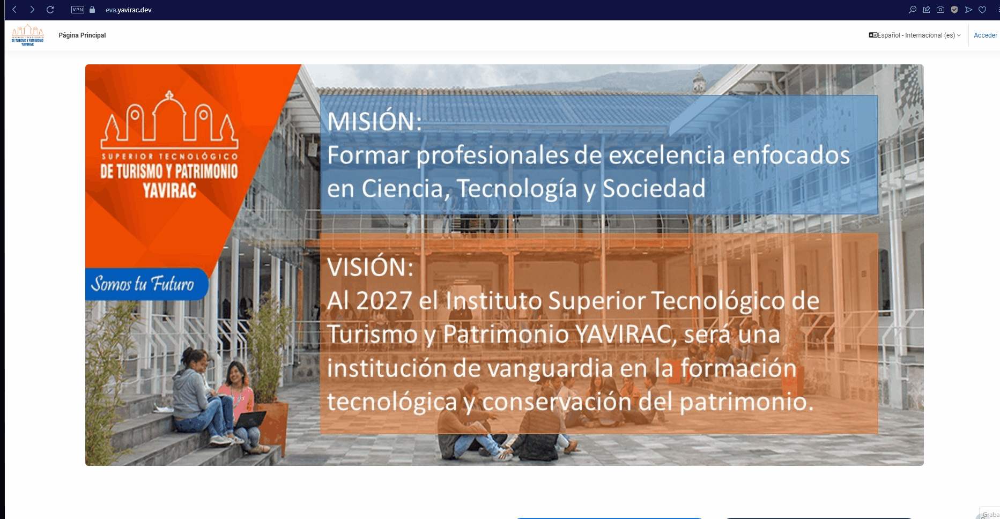
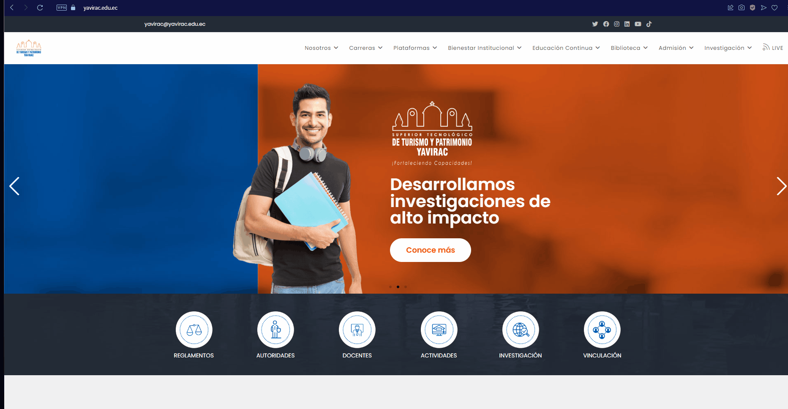
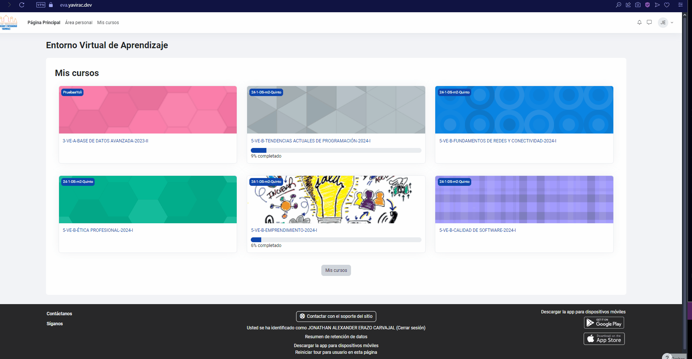

## 1. 🚪 Acceso a la Plataforma

Para comenzar a utilizar el Entorno Virtual de Aprendizaje (EVA), sigue estos pasos:

- **Cómo ingresar**  
  

- **Restablecimiento de contraseña**  
  

- **Configuración del perfil**  
  

