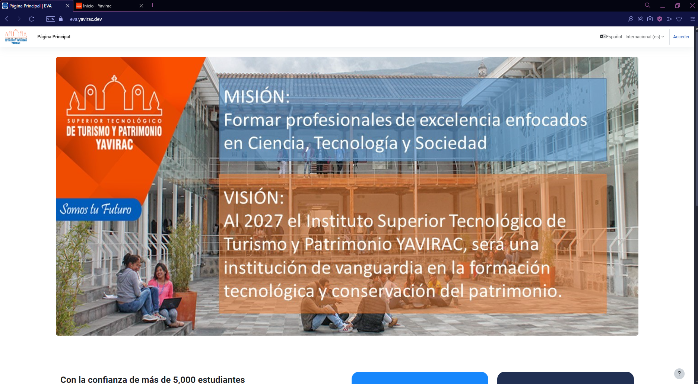
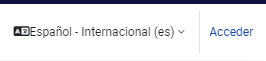

### Cómo ingresar

Para acceder al Entorno Virtual de Aprendizaje (EVA), sigue estos pasos:

1. Dirígete a la URL: [https://eva.yavirac.dev](https://eva.yavirac.dev).  
   

2. Selecciona la opción **"Acceder"**.  
   

3. Si es tu primera vez ingresando, introduce tu número de cédula tanto en el campo de **usuario** como en el de **contraseña**.
   

4. Una vez dentro, el sistema te pedirá que personalices tu contraseña para mayor seguridad. Sigue las instrucciones en pantalla para completar este proceso.
