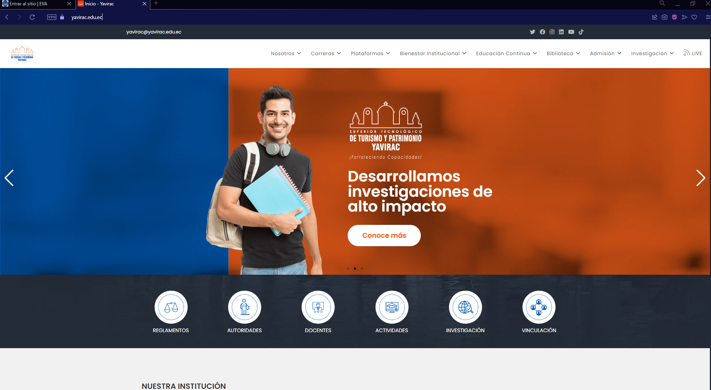
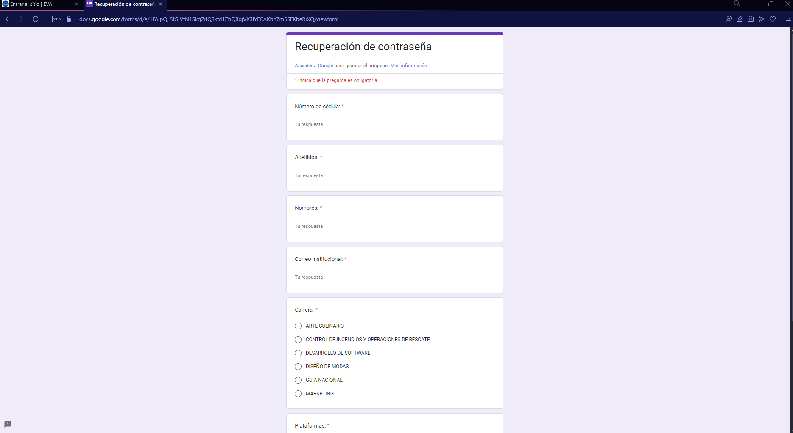

### Restablecimiento de contraseña

Si necesitas restablecer tu contraseña, sigue estos pasos:

1. Dirígete a la página principal: [https://yavirac.edu.ec/](https://yavirac.edu.ec/).  
   

2. Selecciona la opción **"Plataformas"**, lo que desplegará un menú con varias opciones.

3. En el menú desplegable, elige **"Gestión de contraseñas"**.  
   

4. Serás dirigido a un formulario donde podrás solicitar el reseteo de tu contraseña.  
   

Completa el formulario con la información solicitada y sigue las instrucciones para finalizar el proceso de restablecimiento.
